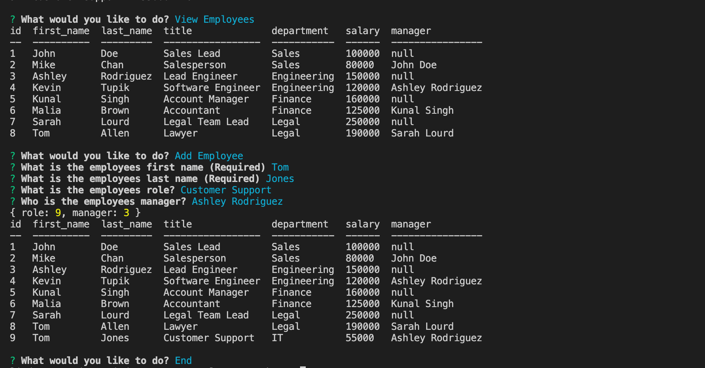
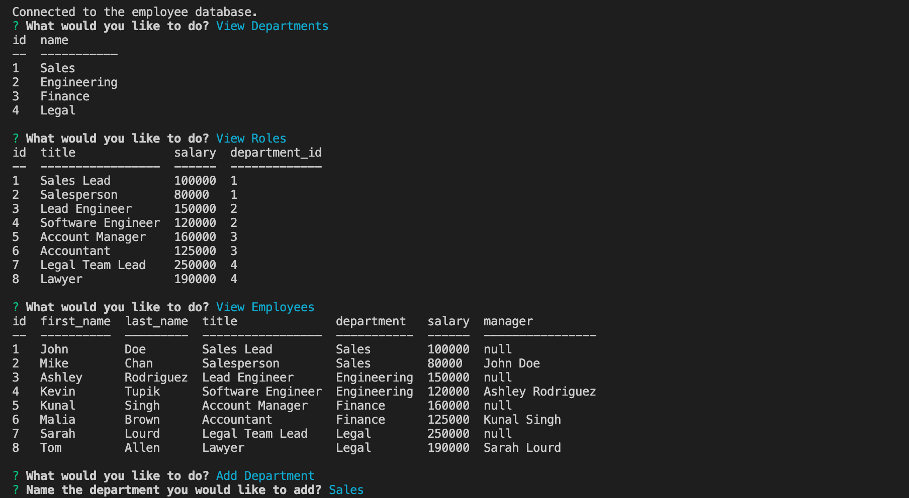

# Employee-Tracker


## Description 
Employee Tracker is a content-management system (CMS). It is command-line application that manages a company's employee database, using Node.js, Inquirer, and MySQL.


## Table of Contents
* [Installation](#installation)
* [User Story](#user-story)
* [Acceptance Criteria](#acceptance-criteria)
* [Usage](#usage)
* [Video](#video)
* [Screenshots](#screenshots)
* [Tests](#tests)


## Installation 

1. Clone the repository from GitHub
1. Install `node.js`
1. Run `npm install` to install dependencies. Dependencies include mysql, console.table, express, inquirer, and jest.
1. Run `mysql -u root -p` to start the database connection. 
1. Updated `connection.js` file with your own mysql user password. 
1. Create the database by running the command: `source db/schema.sql`.
1. Seed the database by running the command: `source db/seeds.sql`.

 
## User Story

```md
AS A business owner
I WANT to be able to view and manage the departments, roles, and employees in my company
SO THAT I can organize and plan my business
```

## Acceptance Criteria

```md
GIVEN a command-line application that accepts user input
WHEN I start the application
THEN I am presented with the following options: view all departments, view all roles, view all employees, add a department, add a role, add an employee, and update an employee role
WHEN I choose to view all departments
THEN I am presented with a formatted table showing department names and department ids
WHEN I choose to view all roles
THEN I am presented with the job title, role id, the department that role belongs to, and the salary for that role
WHEN I choose to view all employees
THEN I am presented with a formatted table showing employee data, including employee ids, first names, last names, job titles, departments, salaries, and managers that the employees report to
WHEN I choose to add a department
THEN I am prompted to enter the name of the department and that department is added to the database
WHEN I choose to add a role
THEN I am prompted to enter the name, salary, and department for the role and that role is added to the database
WHEN I choose to add an employee
THEN I am prompted to enter the employee’s first name, last name, role, and manager, and that employee is added to the database
WHEN I choose to update an employee role
THEN I am prompted to select an employee to update and their new role and this information is updated in the database
```

## Usage
To build a command-line application that manages a company's employee database, using Node.js, Inquirer, and MySQL.


## Video
<p>To View the Video: <a href="https://drive.google.com/file/d/1OAsHK8kMjZYHA3-vMOgguSBajjdZIB1X/view?usp=sharing"> Click Here</a></p>


## Screenshots
<br>
<br>


## Tests 
Jest is available for testing. 
1. In the terminal: run `npm test` to run Jest for tests on constructors.


